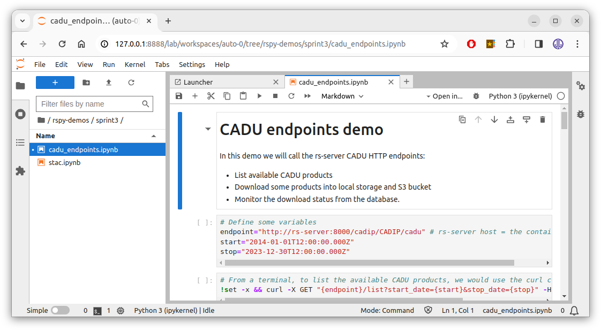

# rs-demo

## Prerequisites

Prerequisites to run the demos locally using Jupyter Notebook: 

  * You have Docker installed on your system, see: https://docs.docker.com/engine/install/
  * You have access to the RSPY project on GitHub: https://github.com/RS-PYTHON
  * You have created a personnal access token (PAT) on GitHub: https://docs.github.com/en/authentication/keeping-your-account-and-data-secure/managing-your-personal-access-tokens
  * You have checked out this git project and submodules and built docker images:

    ```bash
    git clone git@github.com:RS-PYTHON/rs-demo.git # with SSH
    # or `git clone https://github.com/RS-PYTHON/rs-demo.git` with HTTPS

    # Get last version
    cd rs-demo
    git checkout main

    # Checkout the git stac submodules (can take a few minutes)
    git submodule update --init --recursive

    # We need to be in the right directory to run docker compose build
    # to build the stac docker image
    cd ./resources/stac/stac-fastapi-pgstac
    docker compose build # can take a few minutes
    cd - # back to previous dir
    ```

## Run the demos

To pull the latest Docker images, run:

```bash
# Login into the project ghcr.io (GitHub Container Registry)
# Username: your GitHub login
# Password: your personnal access token (PAT) created above
docker login https://ghcr.io/v2/rs-python

# From the resources directory, pull the images
cd ./resources
docker compose pull

# Note: we have a warning 'pull access denied for stac-utils/stac-fastapi-pgstac'
# that is normal: we built this image manually in the prerequisites.
```

Then to run the demos:

```bash
# Still from the resources directory, if you're not there yet
cd ./resources

# Run all services:
docker compose down; docker compose up # -d for detached

# Note: we always need to call 'down' before 'up' or we'll have errors
# when the stac database will initialize a second time.
```

Near the end of the logs you will see some Jupyter information e.g:
```
jupyter | To access the server, open this file in a browser:
jupyter |     ...
jupyter | Or copy and paste one of these URLs:
jupyter |     ...
jupyter |     http://127.0.0.1:8888/lab?token=612cb124335d9ab80a5a6414631a7df186b2401234050001
```

Open (ctrl-click) the http://127.0.0.1:8888/lab?token=... link to open the Jupyter web client (=Jupyter Notebook) in your browser.

__Note__: the token is auto-generated by Jupyter and changes everytime you relaunch the containers. So after relaunching, your old Jupyter web session won't be available anymore.

On the left, in the file explorer, the demos are under `/rspy-demos`:



```bash
# When you're done, shutdown all services and volumes (-v)
# with Ctrl-C (if not in detached mode i.e. -d) then:
docker compose down -v

# You can use this to remove all docker volumes 
# (use with care if you have other docker containers)
docker volume prune
```

## How does it work

The [docker-compose.yml](resources/docker-compose.yml) file uses Docker images to run all the necessary container services for the demos :

  * The latest rs-server images available:
    * Built from the CI/CD: https://github.com/RS-PYTHON/rs-server/actions/workflows/publish-binaries.yml
    * Available in the ghcr.io: https://github.com/orgs/RS-PYTHON/packages
  * The ADGS, CADIP ... station mockups:
    * Built from the CI/CD: https://github.com/RS-PYTHON/rs-testmeans/actions/workflows/publish-docker.yml
    * Also available in the ghcr.io
  * STAC PostgreSQL database
  * MinIO S3 bucket server
  * Jupyter server

These containers are run locally (not on a cluster). The Jupyter notebooks accessed from http://127.0.0.1:8888 are run from the containerized Jupyter server, not from your local environment. This Jupyter environment contains all the Python modules required to call the rs-server HTTP endpoints.

## [TIP] to run your local rs-server code in this environment

It can be helpful to use your last rs-server code version to debug it or to test modifications without pushing them and rebuilding the Docker image.

If your local github repository is under `/my/local/rs-server`,  modify the [docker-compose.yml](resources/docker-compose.yml) file to mount into the `rs-server` services. Use absolute paths. Don't commit this modification !
```yaml
# e.g.
rs-server-adgs:
  # ...
  volumes:
    - /my/local/rs-server/services/common/rs_server_common:/usr/local/lib/python3.11/site-packages/rs_server_common
    - /my/local/rs-server/services/adgs/rs_server_adgs:/usr/local/lib/python3.11/site-packages/rs_server_adgs
    # - and other config files ...
```