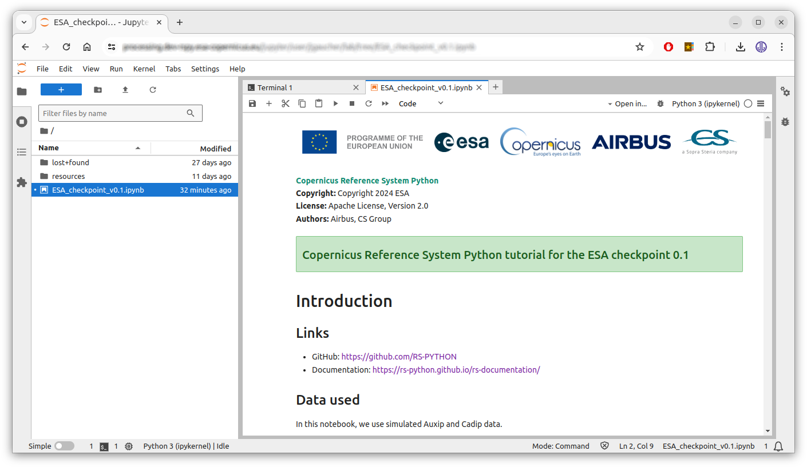

# Running Modes

In this page, we will see how to run the Jupyter notebooks on cluster, local and hybrid mode.

### Quick links 

  * On cluster mode:

      * JupyterHub: <https://processing.ops.rs-python.eu/jupyter>
      * RS-Server website (Swagger/OpenAPI): <https://rspy.ops.rs-python.eu/docs>
      * Create an API key: <https://rspy.ops.rs-python.eu/docs#/API-Key%20Manager/create_api_key_apikeymanager_auth_api_key_new_get>
      * Prefect dashboard (orchestrator): <https://processing.ops.rs-python.eu/>
      * Grafana (logs, traces, metrics): <https://monitoring.ops.rs-python.eu/>

  * On hybrid mode:

      * RS-Server website (Swagger/OpenAPI): <https://rspy.ops.rs-python.eu/docs>
      * Create an API key: <https://rspy.ops.rs-python.eu/docs#/API-Key%20Manager/create_api_key_apikeymanager_auth_api_key_new_get>
      * Prefect dashboard (orchestrator): <http://localhost:4200>
      * Grafana (logs, traces, metrics): <http://localhost:3000/explore>

  * On local mode: 

      * RS-Server website (Swagger/OpenAPI):

          * <http://localhost:8000/docs> (frontend, only for visualization, not functional)
          * <http://localhost:8001/docs> (auxip)
          * <http://localhost:8002/docs> (cadip)
          * <http://localhost:8003/api.html> (catalog)
      
      * Prefect dashboard (orchestrator): <http://localhost:4200>
      * Grafana (logs, traces, metrics): <http://localhost:3000/explore>
      * Minio s3 bucket: <http://localhost:9001/browser> with:

          * Username: `_minio_`
          * Password: `_Strong#Pass#1234_`

## Run on cluster mode

On cluster mode, we run the Jupyter notebooks from our JupyterHub session deployed on the cluster. They connect to the services deployed on the RS-Server website (=cluster). Authentication is required for this mode.

### Prerequisites

* You have access to JupyterHub: <https://processing.ops.rs-python.eu/jupyter>
* You have access to the RS-Server website: <https://rspy.ops.rs-python.eu/docs>
* You have generated an API key from the RS-Server website.

### Run the demos on cluster mode

* Open a JupyterHub session.
* Open a terminal, check that `rs-client-libraries` is installed by running:

    ```shell
    pip show rs-client-libraries # should show the name, version, ...
    ```

* **Optional**: save your API key into your `~/.env` file so it is loaded automatically by your notebooks: 

    ```shell
    # Replace by your value
    echo "export RSPY_APIKEY=xxxxxxxx-xxxx-xxxx-xxxx-xxxxxxxxxxxx" >> ~/.env
    ```

* On the left, in the file explorer, go to the demos or tutorial folder and double-click a notebook to open it:



### Install a new `rs-client-libraries` version

#### Option 1: update the JupyterHub image (affects everyone)

1. Vérify in the CI/CD that the last `rs-client-libraries` modifications were merged into the `develop` branch: <https://github.com/RS-PYTHON/rs-client-libraries/actions/workflows/publish-binaries.yml>

1. Ask the `rs-infrastructure` administrator to run a new CI/CD workflow to publish this `rs-client-libraries` version into a new JupyterHub image.

#### Option 2: from a wheel package (affects only you)

1. In the CI/CD, click on the last `rs-client-libraries` branch workflow that you want to use: <https://github.com/RS-PYTHON/rs-client-libraries/actions/workflows/publish-binaries.yml>, go to the `Artifacts` section and download the `.whl` package file.

1. Or alternatively, build the wheel yourself from your local `rs-client-libraries` project by running: `poetry build --format wheel`

1. Upload the `.whl` package file to your JupyterHub session, open a Terminal and run:

    ```shell
    # Uninstall the old version. Note: this fails if we do it for the first time because 
    # we try to uninstall the root installation of the library, but this this OK.
    pip uninstall -y rs-client-libraries 2>/dev/null

    # You may have conflicts between dependencies installed for the root user
    # and the current user. You can uninstall all current user dependencies with:
    # for dep in $(pip freeze | cut -d "@" -f1); do pip uninstall -y $dep 2>/dev/null; done

    # The old rs-client-libraries version is still installed for the root user.
    # This is the version you (=current user) use by default.
    pip show rs-client-libraries | grep Location # should display: /opt/conda/lib/python3.11/site-packages

    # Install the new version for the current user.
    pip install rs_client_libraries-<version>-py3-none-any.whl
    ```

## Run on local mode

On local mode, docker-compose and Docker images are used to run services and libraries locally (not on a cluster). There is no authentication for this mode.

### Prerequisites

  * You have Docker installed on your system, see: <https://docs.docker.com/engine/install/>
  * You have access to the RSPY project on GitHub: <https://github.com/RS-PYTHON>
  * You have created a personal access token (PAT) on GitHub: <https://docs.github.com/en/authentication/keeping-your-account-and-data-secure/managing-your-personal-access-tokens>

    * This access token is used to retrieve the rs-server product on the github repository.
    * You may want to create a classic PAT with the ```read:packages``` permissions.

  * You have checked out this git project:

    ```shell
    git clone git@github.com:RS-PYTHON/rs-demo.git # either with SSH
    # git clone https://github.com/RS-PYTHON/rs-demo.git # or with HTTPS

    # Get last version
    cd rs-demo
    git checkout develop
    ```

### Run the demos on local mode

To pull the latest Docker images, run:

```shell
# Login into the project ghcr.io (GitHub Container Registry)
# Username: your GitHub login
# Password: your personal access token (PAT) created above
docker login https://ghcr.io/v2/rs-python

# From the local-mode directory, pull the images
cd ./local-mode
docker compose pull
```

Then to run the demos:

```shell
# Still from the local-mode directory, if you're not there yet
cd ./local-mode

# Run all services.
# Note: in case of port conflicts, you can kill all your running docker containers with:
# docker rm -f $(docker ps -aq)
docker compose down -v; docker compose up # -d for detached

# Note: we always need to call 'down' before 'up' or we'll have errors
# when the stac database will initialize a second time.
```

Near the end of the logs you will see some Jupyter information e.g:
```
jupyter | To access the server, open this file in a browser:
jupyter |     ...
jupyter | Or copy and paste one of these URLs:
jupyter |     ...
jupyter |     http://127.0.0.1:8888/lab?token=612cb124335d9ab80a5a6414631a7df186b2401234050001
```

Open (ctrl-click) the ```http://127.0.0.1:8888/lab?token=...``` link to open the Jupyter web client (=Jupyter Notebook) in your browser.

__Note__: the token is auto-generated by Jupyter and changes everytime you relaunch the containers. So after relaunching, your old Jupyter web session won't be available anymore.

To show the Jupyter logs from another terminal, run:

```shell
docker compose logs jupyter
```

On the left, in the file explorer, go to the demos or tutorial folder and double-click a notebook to open it:


```shell
# When you're done, shutdown all services and volumes (-v)
# with Ctrl-C (if not in detached mode i.e. -d) then:
docker compose down -v

# You can use this to remove all docker volumes 
# (use with care if you have other docker containers)
docker volume prune
```

### How does it work

The [docker-compose.yml](local-mode/docker-compose.yml) file uses Docker images to run all the necessary container services for the demos :

  * The latest rs-server images available:
    * Built from the CI/CD: <https://github.com/RS-PYTHON/rs-server/actions/workflows/publish-binaries.yml>
    * Available in the ghcr.io: <https://github.com/orgs/RS-PYTHON/packages>
  * The AUXIP, CADIP ... station mockups:
    * Built from the CI/CD: <https://github.com/RS-PYTHON/rs-testmeans/actions/workflows/publish-docker.yml>
    * Also available in the ghcr.io
  * STAC PostgreSQL database
  * MinIO S3 bucket server
  * Jupyter server

These containers are run locally (not on a cluster). The Jupyter notebooks accessed from <http://127.0.0.1:8888> are run from the containerized Jupyter server, not from your local environment. This Jupyter environment contains all the Python modules required to call the rs-server HTTP endpoints.

### How to run your local rs-server code in this environment

It can be helpful to use your last rs-server code version to debug it or to test modifications without pushing them and rebuilding the Docker image. Follow these steps:

1. Go to the ```local-mode``` directory and run:  

    ```shell
    cp 'docker-compose.yml' 'docker-compose-debug.yml'
    ```

1. If your local `rs-server` github repository is under `/my/local/rs-server`, modify the `docker-compose-debug.yml` file to mount your local `rs-server` services:  

    ```yaml
    # e.g.
    rs-server-adgs:
      # ...
      volumes:
        - /my/local/rs-server/services/common/rs_server_common:/usr/local/lib/python3.11/site-packages/rs_server_common
        - /my/local/rs-server/services/adgs/rs_server_adgs:/usr/local/lib/python3.11/site-packages/rs_server_adgs
        - /my/local/rs-server/services/adgs/config:/usr/local/lib/python3.11/site-packages/config
        # - and any other useful files ...
    ```

1. Run the demo with:  

    ```shell
    # Still from the local-mode directory, if you're not there yet
    cd ./local-mode

    # Run all services
    docker compose down -v; docker compose -f docker-compose-debug.yml up # -d for detached
    ```

## Run on hybrid mode

On hybrid mode, we run the Jupyter notebooks locally, but they connect to the services deployed on the RS-Server website (=cluster). Authentication is required for this mode.

### Prerequisites

* You have access to the RS-Server website: <https://rspy.ops.rs-python.eu/docs>
* You have generated an API key from the RS-Server website.
* You have saved the S3 bucket configuration in you local file: `~/.s3cfg`
* Python is installed on your system.

You also need the rs-client-libraries project:

  * If you have its source code, install it with:

    ```shell
    cd /path/to/rs-client-libraries
    pip install poetry
    poetry install --with dev,demo
    poetry run opentelemetry-bootstrap -a install
    ```

  * Or if you only have its ```.whl``` package, install it with: 

    ```shell
    pip install rs_client_libraries-*.whl
    # then install jupyter lab
    pip install jupyterlab
    ```

### Run the demos on hybrid mode

From your terminal in the rs-demo, run:

```shell
export RSPY_APIKEY=your_api_key # see the prerequisites

# NOTE: at CS France premises, use this to deactivate the proxy which causes random errors
unset no_proxy ftp_proxy https_proxy http_proxy

# To use your local rs-client-libraries source code
cd /path/to/rs-client-libraries
# git checkout develop && git pull # maybe take the latest default branch
poetry run /path/to/rs-demo/hybrid-mode/start-jupyterlab.sh

# Or if you have installed it from rs_client_libraries-*.whl, 
# just run
/path/to/rs-demo/hybrid-mode/start-jupyterlab.sh
```

The Jupyter web client (=Jupyter Notebook) opens in a new tab of your browser. 

*WARNING*: the cluster is shut down from 18h30 to 8h00 each night and on the weekends.

### How to check your Python interpreter used in notebooks

In a notebook cell, run: 
```python
import sys
print(sys.executable)
```

If you use the rs-client-libraries poetry environment, it should show something like:
```shell
${HOME}/.cache/pypoetry/virtualenvs/rs-client-libraries-xxxxxxxx-py3.11/bin/python
```